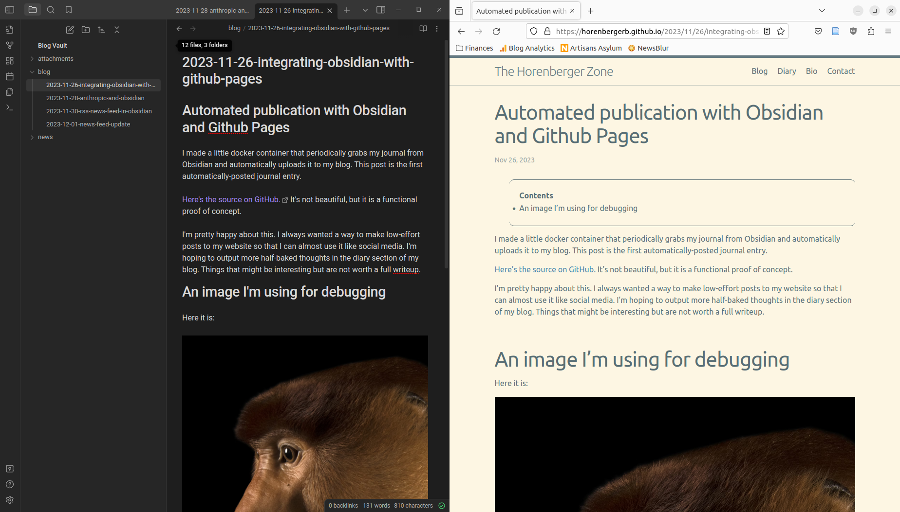
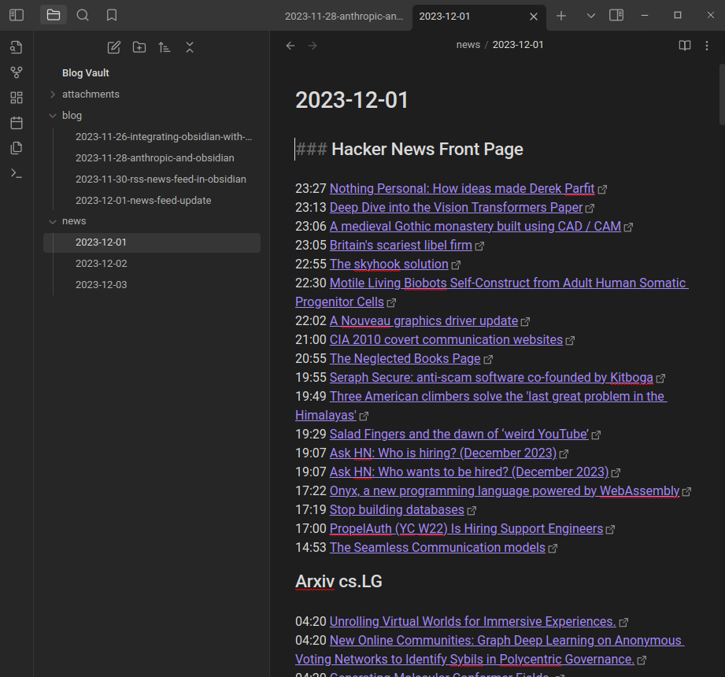
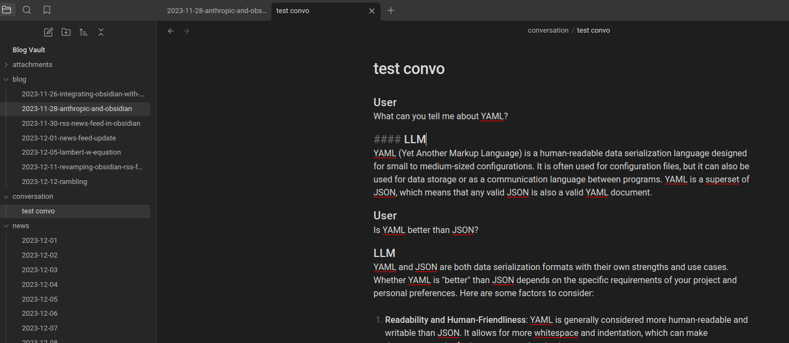

# Obsidian Github Pages Sync

This project automatically updates your github pages blog with files from your Obsidian vault.



I am also tentatively expanding the vision of this project. I recently added support for parsing RSS feeds into Obsidian notes.



And now it also has integration with LLMs. It deploys a language model locally via [llama.cpp](https://github.com/ggerganov/llama.cpp) and hosts conversations inside Obsidian:




# Setup

## Dependencies

This project relies on the [Nvidia Container Toolkit](https://docs.nvidia.com/datacenter/cloud-native/container-toolkit/latest/install-guide.html) for Nvidia GPU support.

The configuration of llama.cpp in /src/llm_integration/llama_cpp_server_manager.sh is optimized for my setup, which is an Nvidia 3090 GPU.

## Configuration

Configuration is in a bad state right now. There are directories and arguments that need to be configured in container_manager.sh, copy_and_commit.sh, and Dockerfile. You also need to add your github token in a github_token.txt file.

## Running the docker

To run, simply execute `./container_manager.sh start`

You can stop the docker container with `./container_manager.sh stop`

container_manager also has utilities for troubleshooting the container. Run './container_manager' for more info.

# How it works

## How Obsidian is synchronized with a Github Pages blog

### Periodically identify Obsidian pages to upload

1) The Dockerfile creates a cron job which periodically runs copy_and_commit.sh
2) copy_and_commit.sh compares the Obsidian dir to a staging directory. If there is no difference, exit
3) If there is a difference, clear the staging directory and copy the obsidian dir into staging

### Parse and upload Obsidian new pages

1) Parse the staging dir into blog-compatible markdown and output to the a parsed staging directory
2) Copy all images from Obsidian image dir to the user-specified github pages directory.
3) Update image links in markdown files to point to new destination
4) Parse the staging dir into blog-compatible markdown and output to the user-specifed github pages directory
5) Commit the changes to github

## How RSS feeds are uploaded to Obsidian notes

This is pretty simple. Cron job periodically runs a python script to retrieve news from RSS feeds. This is stored and organized in a sqlite database. Then the titles of the most recent news articles are parsed into a markdown format and added to Obsidian.

## How conversations with LLMs are facilitated

The model is loaded via llama.cpp's built-in server functionality. A cron job periodically runs a Python script which parses all conversations and looks for conversations marked for generation. It formats these conversations and sends a request to the llama.cpp server for chat completion. Then, it updates the markdown file with the new response.

### How to use/format a conversation

Conversations are formatted as follows:

```
#### User
What can you tell me about YAML?
#### LLM
YAML (Yet Another Markup Language) is a human-readable data serialization language designed for small to medium-sized configurations. It is often used for configuration files, but it can also be used for data storage or as a communication language between programs. YAML is a superset of JSON, which means that any valid JSON is also a valid YAML document.
#### User
Is YAML better than JSON?
```

When you want a response from the model, mark the conversation by appending the `#g` tag to a new line:
```
#### User
What can you tell me about YAML?
#### LLM
YAML (Yet Another Markup Language) is a human-readable data serialization language designed for small to medium-sized configurations. It is often used for configuration files, but it can also be used for data storage or as a communication language between programs. YAML is a superset of JSON, which means that any valid JSON is also a valid YAML document.
#### User
Is YAML better than JSON?
#g
```

# FAQ

#### I want to synchronize Obsidian with my blog, but I don't want the news feed stuff. What should I do?

Create an issue in the GitHub repo. To my knowledge, I'm the only one using this code, but I'd happily make accomodations if anyone else wanted to use this. Make me aware and I'll see what I can do

#### I don't want Nvidia integration. How do?

Please create an issue in the GitHub repo. I'll work on this if there's any genuine interest.